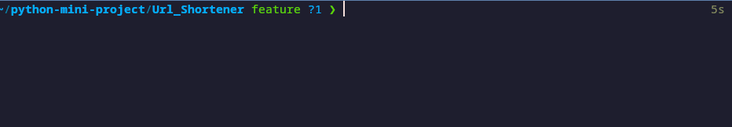

# URL Shortener

  

  

<!--An image is an illustration for your project, the tip here is using your sense of humour as much as you can :D

  

You can copy paste my markdown photo insert as following:

-->

  

## 🛠️ Description

<!--Remove the below lines and add yours -->

A cli url shortener.

  

## ⚙️ Languages or Frameworks Used

<!--Remove the below lines and add yours -->

  
    pip install -r requirements.txt

## 🌟 How to run

<!--Remove the below lines and add yours -->

1. Replace the api_key in url_shortener.py to your bitly api key
2. Run the file !!

  

## 📺 Demo

  

## 🤖 Author

<!--Remove the below lines and add yours -->

[Eshan Chathuranga](https://github.com/sky7026)
